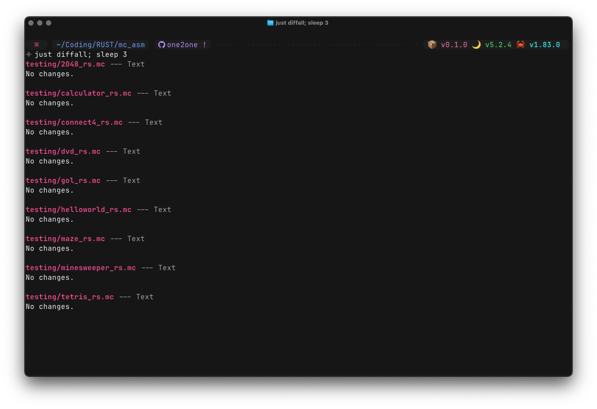

# MC_ASM

This is the seperate repo for my [rust rewrite]() of mattbatwings [BatPU-2]().

### Roadmap:
**v0.1.0:**
- [x] a 1-to-1 python-to-rust translated implementation of the assembler program

**v0.2.0:**
- [ ] `.schem` file generator implementation in rust

**v1.0.0:**
- [ ] all-in-one cli program
	- [ ] subcommands
	- [ ] shell completions
	- [ ] `.bat files` for my windows fellas (so you can just drag a program file onto the bat file on your desktop with no terminal)

**v1.1.0:**
- [ ] `.litematic` file generator

**v2.0.0:**
- [ ] assembler rewrite in *actual, idiomatic* rust

**Future versions:**
- multiple assembly languages?
- hot-reloading?

